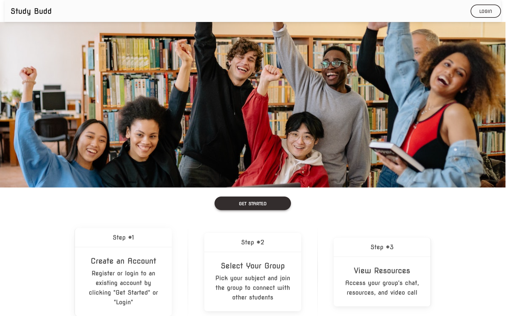
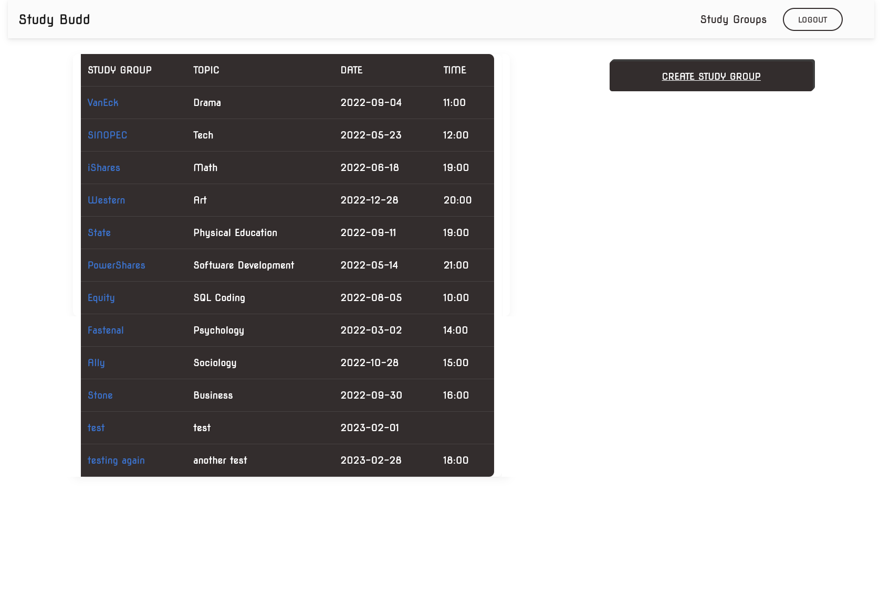
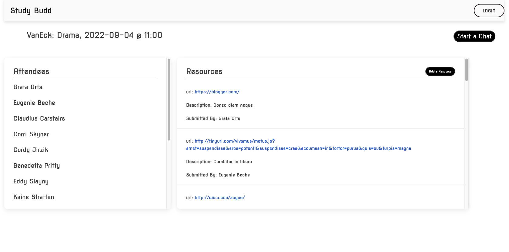
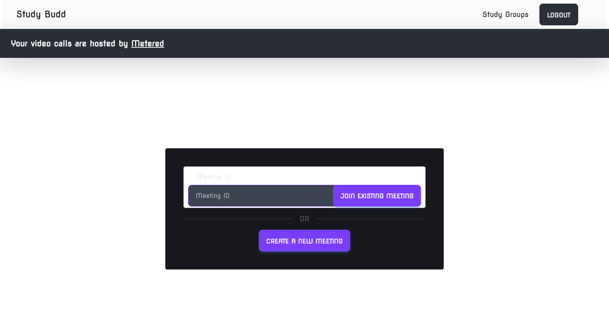

#  Study Budd - Study Group App

[](https://opensource.org/licenses/MIT)


## Links

- The repo of the note app: [Source Code](https://github.com/EshuShango/study-group-project)
- Here is the link of live demo app via Heroku: [Demo]()


## Description 🔎

 A WEB application to create virtual study groups using Node.js, Express.js, Sequelize,  Handlebars.js *`(at least one handlebar)`, Inquirer, MySQL and MVC architecture.

## Table of Contents 📖
- [Usage](#usage-🔑) 
- [License](#license-📝)
- [Mock up](#mock-up) 
- [Things I Learned](#things-i-learned-📚)
- [Sources](#sources)
- [Team](#team-👨‍👩‍👧‍👦)
- [RoadMap](#roadmap-🧭)

## Usage 🔑
```md
As a Student, I want to be able to connect with students in space that provides easy chatting and resource sharing 
WHEN I log into the application
THEN I am able to create and view study groups as well as add resources and launch a video chat with fellow Students.
```


## License 📝
'click the license badge at the beginning of the document to get more info'

## Mock-Up 






## Things We Learned 📚
* `Building a fully functional web application including client-side and server-side from start to finish`
* `Versatility with sequelize, especially with a larger database`
* `Utilizing sequelize to pull from the entire database utilizing join tables and foreign keys`
* `Ease of use with Handlebars in easily serving data to the client-side, how it helps clean up routing`
* `How modular express can be, I.E creating clean and easily readable yet complicated server structures with express`
* `Most importantly: Metered. The metered api is extremely versatile, and can cut down code by thousands of lines just from their api, and their video chat api is genius. their docs are also super in depth and great for learning they taught me a heck of a lot of new stuff`
* `Working together as a group, utilizing our strengths to code the different parts of the site,troubleshooting as a team`

## Sources

* [MD Bootstrap](https://mdbootstrap.com/)
* [Metered Groups](https://www.metered.ca/docs/Video-Calls/JavaScript/Building-a-Group-Video%E2%80%93Calling-Application/)
* [Metered Video](https://www.metered.ca/docs/)

## Team 👨‍👩‍👧‍👦

- [https://github.com/whotf1](https://github.com/whotf1)

- [https://github.com/kcschaefs](https://github.com/kcschaefs)

- [https://github.com/zachshouts](https://github.com/zachshouts)

- [https://github.com/EshuShango](https://github.com/EshuShango)


## RoadMap 🧭
 * `Add ability for users to sign up for study groups`
 * `Refactor code to be more efficient` 
 * `Make UI "prettier"` 
 * `Continued improvements to make the app more user friendly` 
 * `Add functionality to manage your user profile` 
  * `Add functionality to dm other users` 
